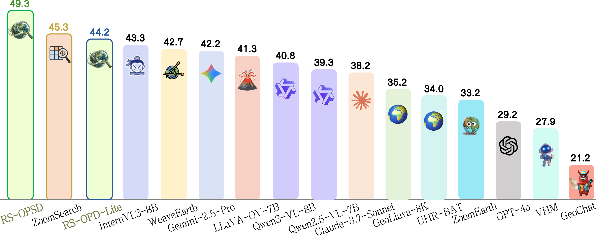
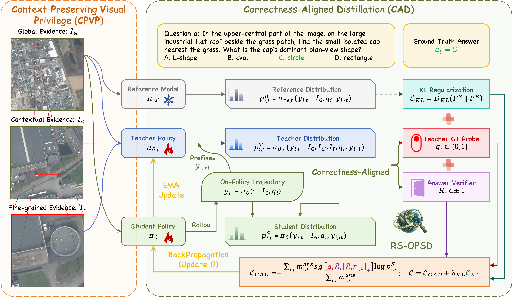
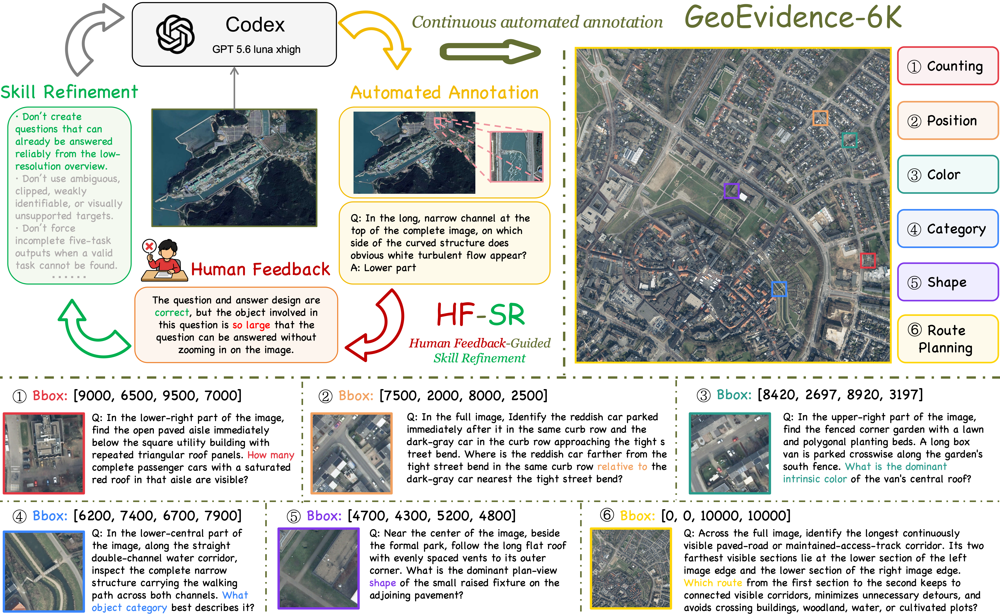
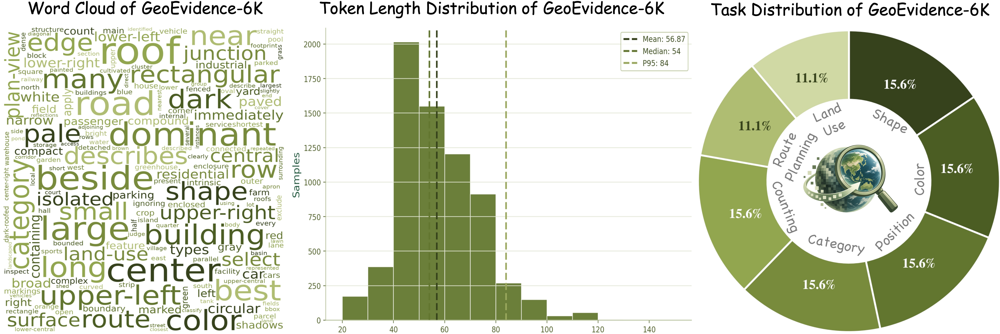

  

<h1 align="center">
  
</h1>

  
  
  
  
  

## Leaderboard

  

Average scores across **XLRS-Bench**, **MME-RealWorld-RS**, and **LRS-VQA**.
RS-OPSD achieves the best results on all three benchmarks among the methods
compared in the paper, improving the average score over the strongest competing
method, ZoomSearch, by **4.0 percentage points**.

| Model | Inference model size | XLRS-Bench | MME-RealWorld-RS | LRS-VQA | Average | Latency (s/sample) |
| --- | --- | --- | --- | --- | --- | --- |
| Qwen3-VL-8B-Instruct | 8B | 50.5 | 41.9 | 30.1 | 40.8 | 1.75 |
| RS-OPD-Lite | 2B | 45.8 | 56.2 | 30.5 | 44.2 | **1.09** |
| RS-OPSD | 8B | **53.1** | **61.5** | **33.3** | **49.3** | 1.58 |

Latency is measured on a **single NVIDIA H100 with batch size 1**, averaged
across the three benchmarks under the paper's evaluation protocol.
RS-OPD-Lite surpasses most evaluated 8B-scale models and achieves the lowest
measured latency—**12.8% lower** than the second-fastest method.
Neither variant requires additional visual search or external tool calls at
inference time.

## Method overview

<table>
  <tr>
    <td><em>Can the benefit of zoom-in evidence be internalized during training, rather than requiring visual search or tool use at inference time?</em></td>
  </tr>
</table>

  

**Context-Preserving Visual Privilege (CPVP): what should the teacher see?**
The teacher receives three complementary views: **Global Evidence** preserves
scene-level context, **Contextual Evidence** retains the target and its
surroundings, and **Fine-grained Evidence** provides a tight target crop.
The student and frozen reference model receive only the global view.

**Correctness-Aligned Distillation (CAD): when should the student trust it?**
The student generates one on-policy response. Instead of generating a separate
trajectory, the privileged teacher evaluates the same student-generated prefixes.
CAD filters supervision at two levels:

- **Sample-level reliability:** a teacher-forced ground-truth-prefix probe keeps
  samples only when the teacher selects the GT continuation at every probe
  position within the valid candidate set.
- **Token-level alignment:** for a correct student answer, retain teacher
  preferences that reinforce the sampled tokens; for an incorrect answer,
  retain preferences that suppress them. Unreliable or conflicting signals are
  discarded.

## GeoEvidence-6K

### Dataset construction

  

**GeoEvidence-6K** pairs UHR remote sensing questions with explicit
question-relevant evidence regions. It contains **6,750 VQA samples** derived
from **1,050 source images** across five public sources: MiniFrance, HRSCD,
SWISSIMAGE, GeoNRW, and Beeldmateriaal. Source images average
**10,714 × 10,714 pixels**, while annotated target regions average
**1,095 × 1,074 pixels**—roughly **1%** of the full-image area.

**Human Feedback-Guided Skill Refinement (HF-SR)** turns human corrections into
reusable annotation skills, rather than only correcting individual samples.
The annotation agent first examines a downsampled overview, then inspects
candidate regions at native resolution to produce evidence boxes, questions,
and reference answers. Human reviewers check the image, target region, and
annotation together. Recurring errors and corrections are consolidated into
procedural rules for subsequent annotation, with frequent early refinement and
progressively longer intervals as the skill stabilizes.

### Dataset statistics

  

The seven task categories span five **local-evidence tasks**—counting, position,
color, category, and shape—and two **global-context tasks**—land use and route
planning. Each local-evidence task accounts for approximately **15.6%** of the
dataset; each global-context task accounts for approximately **11.1%**.
The reported question-token distribution has a mean of **56.87**, median of
**54**, and 95th percentile of **84**.

The standardized release contains **6,000 single-choice** and **750
multiple-choice** questions, together with four processed image views:
`plain`, `global`, `contextual`, and `evidence`. Original large images are not
included. Download the dataset and find its usage guide on
[Hugging Face](https://huggingface.co/datasets/ronniejiangC/GeoEvidence-6K).

## Paper and project page

The arXiv paper and project page links are **coming soon**. Their badges above
are placeholders and will be updated when the pages are available.

## Repository layout

The repository is organized around the proposed method and a standalone
evaluator. It intentionally excludes datasets, checkpoints,
experiment logs, and other generated artifacts.

| Path | Purpose |
| --- | --- |
| `rs-opsd/` | RS-OPSD training implementation, configurations, unit tests, and runtime launchers. |
| `eval/` | OpenAI-compatible evaluator for LRS-VQA, MME-RealWorld Remote Sensing, and XLRS-Bench. |
| `eval/scripts/` | Local evaluation and environment launchers. |

## RS-OPSD training

The main experiments train exclusively on GeoEvidence-6K with **one rollout
per sample**, a **global batch size of 96**, **KL coefficient 0.001**, and
**gradient-norm clipping threshold 5**. RS-OPSD is trained for **150 steps**;
RS-OPD-Lite is trained for **120 steps**. These are the paper's reported settings;
select the appropriate model, teacher-update policy, and runtime configuration
when reproducing either variant.

Use a compatible PyTorch/vLLM environment, a local Qwen3-VL model, and the
GeoEvidence dataset layout described in [the training guide](rs-opsd/README.md).
Install dependencies appropriate for your accelerator platform, then run:

    cd rs-opsd
    python3 -m venv .venv
    .venv/bin/python -m pip install -r requirements.txt

    MODEL_PATH=/path/to/Qwen3-VL-8B-Instruct \
    DATA_ROOT=/path/to/GeoEvidence-6K \
    OUTPUT_DIR=/path/to/output \
    PYTHON=.venv/bin/python PA_OPD_NUM_GPUS=4 \
    bash scripts/train.sh direct-2k-three-image-kl

`DATA_ROOT` must contain `train.jsonl`, `images/`, and `teacher_images/`;
the three-view recipe additionally needs `derived/train.jsonl` and
`derived/teacher_images/`. Set `OUTPUT_DIR` explicitly for generated artifacts.
The directory is now `rs-opsd/`; internal `pa_opd_*` fields and `PA_OPD_*`
environment variables retain their names for compatibility. Existing data and
checkpoint paths are unchanged.

## Evaluation

The evaluator sends requests to an OpenAI-compatible model server and supports
LRS-VQA, MME-RealWorld Remote Sensing, and XLRS-Bench. Install its lightweight
client dependencies and point it at a running server:

    python3 -m venv .venv-eval
    .venv-eval/bin/pip install openai pillow datasets
    .venv-eval/bin/python -m eval.run --dataset lrs-vqa --lrs-root /path/to/lrs-vqa --api-base http://localhost:8000/v1 --model-id your-served-model-name

To create a dedicated vLLM environment and serve a local checkpoint first, run
MODEL_PATH=/path/to/model LRS_ROOT=/path/to/lrs-vqa BENCHMARK=lrs-vqa bash
eval/scripts/run_local_vllm.sh. Use --dry-run with eval.run to validate a
dataset layout before starting a server. Full options are in eval/README.md.

## Reproducibility and artifacts

Datasets, model weights, checkpoints, W&B data, Ray output, and evaluation
results are deliberately ignored by Git. Supply local paths through the
environment variables shown above. This repository contains no cluster- or
scheduler-specific submission scripts.

## License

RS-OPSD is distributed under the [Apache-2.0 license](rs-opsd/LICENSE).

## Acknowledgements

We thank the teams behind the following works for their contributions and open resources:

- **XLRS-Bench** — [Paper](https://arxiv.org/abs/2503.23771) · [Code and dataset](https://github.com/AI9Stars/XLRS-Bench)
- **MME-RealWorld** — [Paper](https://arxiv.org/abs/2408.13257) · [Project page](https://mme-realworld.github.io/)
- **LRS-VQA** — [Paper](https://arxiv.org/abs/2503.07588) · [Code and dataset](https://github.com/VisionXLab/LRS-VQA)
- **Vision-OPD** — [Paper](https://arxiv.org/abs/2605.18740) · [Code](https://github.com/VisionOPD/Vision-OPD)
